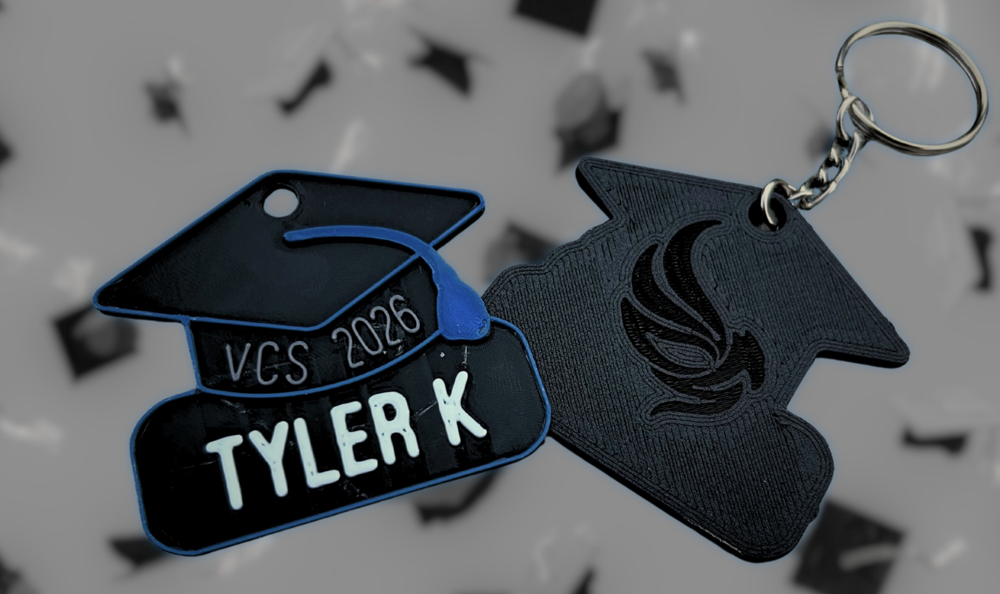
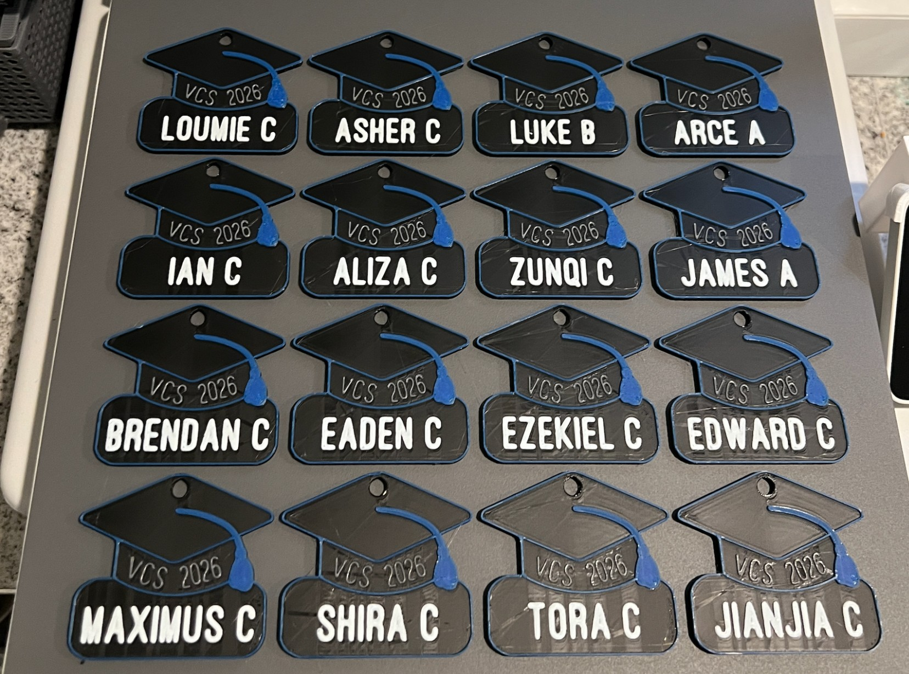

As part of Grad Council, I used my 3D design and printing skills to create personalized grad keychains, which were distributed on the first day of school.

To ensure inclusivity, we coordinated with the school office over the summer to confirm the full class list so no one was left out.

I am currently considering expanding this idea by creating parent versions of the keychains as memorabilia and as a potential fundraising initiative for Grad Council.

