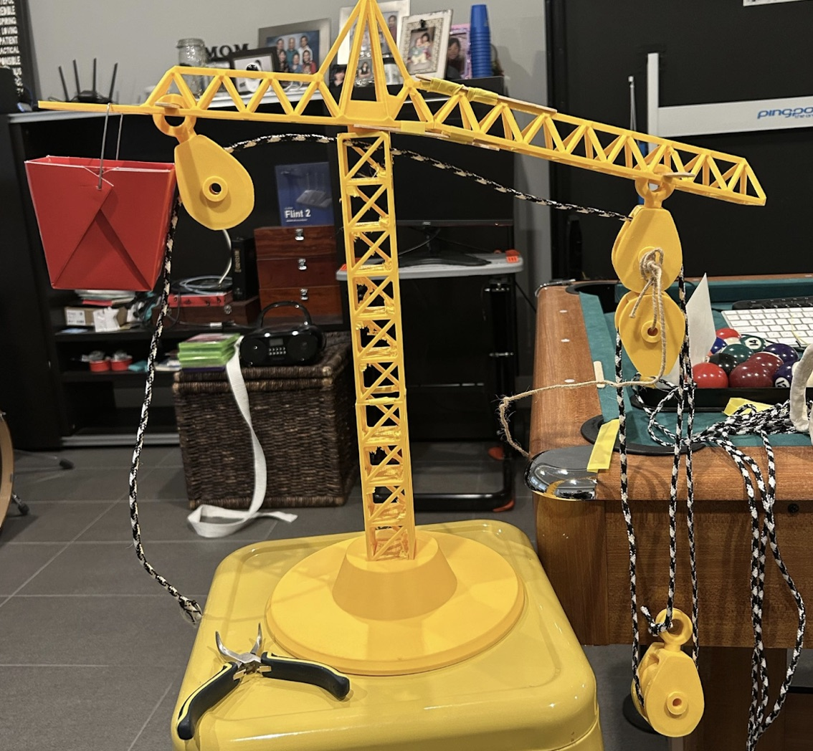

This a project involves building a 3D-printed model crane to show how real construction cranes lift massive objects. It uses a special arrangement of wheels and rope—known as a pulley system—which allows a smaller weight to lift a much heavier one by spreading the load across several strands of rope.

Youtube Demo

