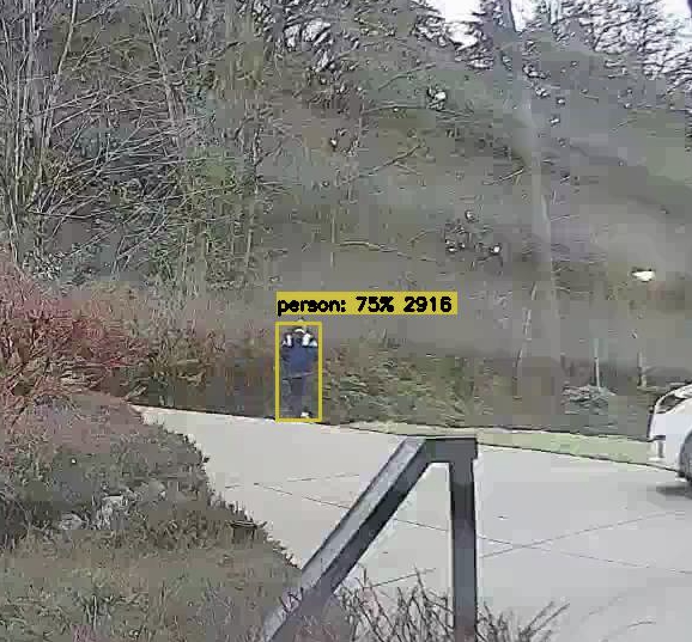

Using machine learning, I created a person and bear detection system to send out notifications when there is person on our driveway.  It was made using an opensource software and opensource vision model.

