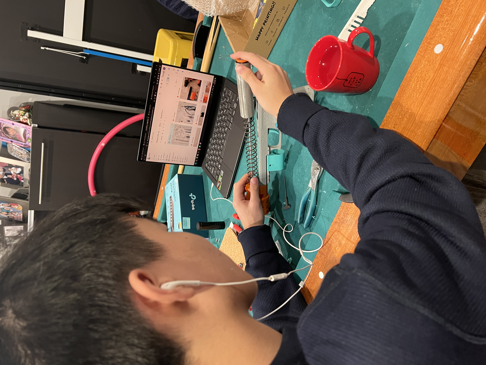

I have long been interested in Nerf blasters, and as I developed skills in 3D design and printing, I began designing, assembling, and modifying my own blasters and toys.

This hobby has allowed me to apply engineering concepts, prototyping, and iterative design in a hands-on way.

