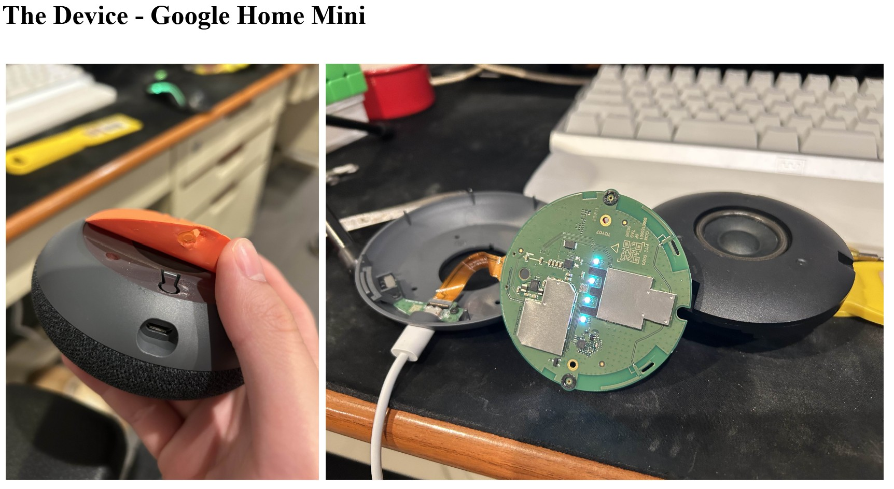
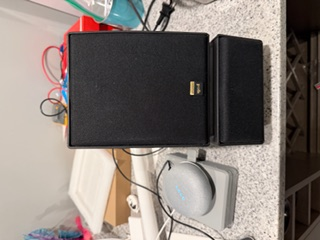

Please see the attached description and images outlining how I repurpose **old or unused** technology for new and practical uses.

The Google Home Mini was released during the peak of the covid season, being a
voice-activated device that is essentially a Siri without the phone. It still has very good utility up
to today, but it falls short of its small speaker, which is why we are going to enhance it.

