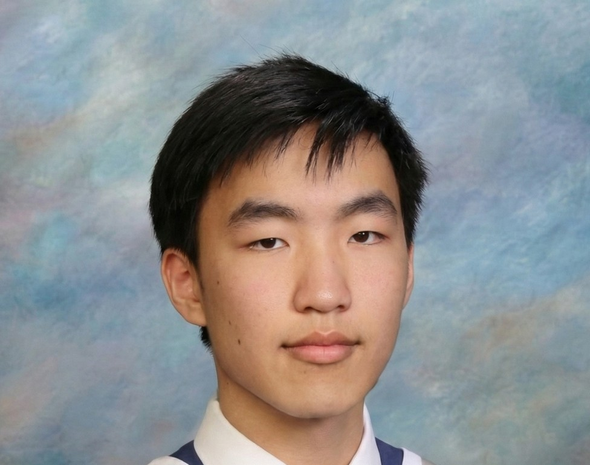

<!-- /index.md -->
# About Me

Hey there! I’m **Tyler K**, a North Burnaby teen who’s all about sustainability and community.

I started this library of free activities for families visiting grandparents because I believe small things (like a shared puzzle or game) can create big moments.

My goal is to bring generations together and cut down on waste by encouraging borrowing instead of buying.

Explore "Activities" to see what’s here, and keep checking back as the library grows!

